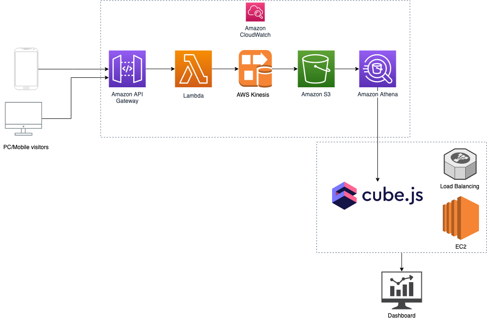

# Google Analytic like Backend System Design

Base on the requirements:
- handle large write volume
- handle large read/query volume
- run with minimum downtime
- have the ability to reprocess historical data in case of bugs in the processing logic

I choose Amazon Web Services.

## System design diagram

## System breakdown
### PC/Mobile Visitors Tracking Code
Every web page or mobile site tracked by an embed tracking code that collects data about the visitor. It loads an async script that assigns a tracking cookie to the user if it is not set. It also sends an XHR request for every user interaction.

### Amazon API Gateway
Acting as the "front door" for applications to access data, business logic, or functionality from backend services.

### Lambda, Kinesis, S3
Visitor's events will be passed to Lambda where event data is processed and written to a Kinesis Data Stream. Kinesis Firehose uses the Kinesis Data Stream as input and writes processed parquet files to S3.

### Athena
Athena is used to query parquet files directly from S3.

### Amazon CloudWatch
These services (API Gateway, Lambda, Kinesis, S3, Athena) will be monitor and logs by Amazon CloudWatch. I can keep tracking and set alarm for any metrics, also react to resource changes.

### [Cube.js](https://github.com/cube-js/cube.js) - Open Source Analytics Framework
Cube.js will generate SQL analytics queries and provide an API for viewing the analytics in a browser. I will run Cube.js inside EC2 instances and Elastic Load Balancing.